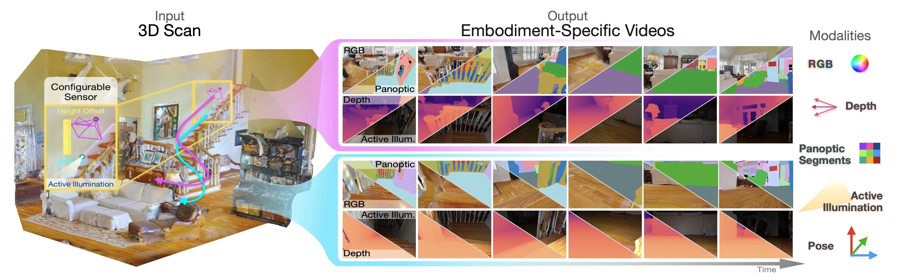
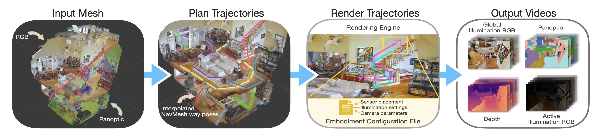

# Massive Video Panoptic dataset (MVPd)




This repository hosts the code used for creating and processing the Massive Video Panoptic dataset (MVPd).

---

### Setup

#### Cloning Source

```
git clone -b main --recurse-submodules git@github.com:opipari/MVPd.git
```

#### Downloading Dataset

All MVPd data can be downloaded from the following [dropbox link](https://www.dropbox.com/scl/fo/684rsez9g9z7jwsy3dy3g/AMkJr5h1DyPJt6tZpY1vxDo?rlkey=h46o93asvsd5eexpwc5iwelwq&e=1&st=381rd84e&dl=0).

The MVPd dataset is split into `train/val/test` subsets at the scene-level. Each scene's color, depth, and panoptic videos are compressed into individual tar files and stored in their respective split folder at the above dropbox location. In other words, there is a separate tar file for the videos and segment labels of each scene.

After downloading the dataset, place each scene's tar file into the corresponding folder within the `MVPd/` directory. That is, put each train scene tar file into `MVPd/train/`, all validation scene tar files into `MVPd/val/` and all test scene tar files into `MVPd/test/`.

#### Formatting Dataset

Run the following commands to extract the tar files into expected format:

**Note, by default the formatting script will remove each tar file from system after it is extracted**

- Extract train scenes: `./scripts/preprocessing/format.sh -s train -m` 
- Extract validation scenes: `./scripts/preprocessing/format.sh -s val -m` 
- Extract test scenes: `./scripts/preprocessing/format.sh -s test -m` 

Minor: The `-m` flag is used to run a minimization process to reduce the final annotation file sizes. Running the scripts without `-m` will keep all annotation meta data at the expense of additional disk space.

#### Dataset Structure

This script will result in the following collated directory structure:

```
.                         			# Root project directory
└── MVPd					# Directory containing the video data
	├── train
	│   ├── panoptic_train.json      	# Annotation file inspired by COCO panoptic format (https://cocodataset.org/#format-data)
	│   │
	│   ├── panomasksRGB              	# Directory containing panoptic labels
	│   │   └── {video_ID}            	# Single video directory
	│   │       ├── {view_IDX}.png    	# COCO panoptic api formatted label image
	│   │       │...
	│   │
	│   ├── imagesRGB  	# Directory containing RGB images (ambient scene illumination by default)
	│   │   └── {video_ID}            	# Single video directory
	│   │       ├── {view_IDX}.jpg    	# JPEG formatted color image
	│   │       │...
	│   │
	│   └── imagesDEPTH               	# Directory containing depth images for each video
	│       └── {video_ID}            	# Single video directory
	│           └── {view_IDX}.png    	# UINT16 formatted depth image in millimeters (factor of 1/1000 to convert to meters)
	│
	└── val
        │   ├── panoptic_val.json         	# Annotation file
	│   │
	│   ├── panomasksRGB              	# Directory containing validation set panoptic labels
	│   │   └── ...
	│   ├── imagesRGB  			# Directory containing validation set RGB images
	│   │   └── ...
	│   └── imagesDEPTH               	# Directory containing validation set depth images for each video
	│       └── ...
	└── test
            ├── panoptic_test.json         	# Annotation file
	    │
	    ├── panomasksRGB              	# Directory containing test set panoptic labels
	    │   └── ...
	    ├── imagesRGB  			# Directory containing test set RGB images
	    │   └── ...
	    └── imagesDEPTH               	# Directory containing test set depth images for each video
	        └── ...
```

For details on the annotation file formats, kindly refer to [MVPd_format.md](MVPd_format.md).

<hr>


# Data Generation Pipeline




## Creating New Data

The process for creating new data is as follows:

1. Create or source an existing RGB-Semantic mesh that is compatible with [Habitat-Sim](https://github.com/facebookresearch/habitat-sim) for trajectory sampling
2. Simulate camera trajectories using MVPd data generation pipelin in conjunction with Habitat-Sim's API to the [Recast Navigation](https://github.com/recastnavigation/recastnavigation) Mesh
3. Render the simulated camera trajectories using Blender to create color, depth, and panoptic segment videos
4. Post-process the simulated images into desired format or use with the `[MVPDataset](MVPd/utils/MVPdataset.py)` pytorch dataset


#### [Habitat Matterport 3D Semantic Dataset](https://aihabitat.org/datasets/hm3d-semantics/)

1. Create an account on [Matterport website](https://buy.matterport.com/free-account-register?_ga=2.183460966.1764739312.1687379653-577208820.1687379653)
2. Request access to the dataset by accepting [the terms and conditions](https://matterport.com/matterport-end-user-license-agreement-academic-use-model-data)
3. Download the [v0.2 dataset files](https://github.com/matterport/habitat-matterport-3dresearch#-downloading-hm3d-v02)
4. Extract dataset files into the following directory structure
    ```
    .                                                             # Root directory of HM3DSem dataset
    ├── hm3d_annotated_basis.scene_dataset_config.json            # JSON files describing scene information per-subset of the overall dataset
    ├── hm3d_annotated_example_basis.scene_dataset_config.json    # The dataset is broken down into a collection of scans (i.e. 'scenes'), each at building scale
    ├── hm3d_annotated_minival_basis.scene_dataset_config.json
    ├── hm3d_annotated_train_basis.scene_dataset_config.json
    ├── hm3d_annotated_val_basis.scene_dataset_config.json
    ├── example                                                   # Directory containing a single scene directory (00337, 00770, and 00861)
    ├── minival                                                   # Directory containing 10 scene directories subsampled from overall val set
    ├── train                                                     # Directory containing most scenes in the dataset
    └── val                                                       # Directory containing scenes to be used for model validation (chosen by dataset authors)
    ```


#### Setup Simulation Virtual Environemt

To simulate new data in the format of MVPd, first setup a virtual environment for processing:

```
python3.8 -m venv ./envs/mvpd && \
  source ./envs/mvpd/bin/activate && \
    pip install -r ./requirements/mvpd.txt && \
      deactivate
```


### Simulation Setup

#### Install Blender

By default, we use [blender](https://www.blender.org/) version 3.3.7:

```
wget -P ./simulators/blender/ https://mirrors.ocf.berkeley.edu/blender/release/Blender3.3/blender-3.3.7-linux-x64.tar.xz && \
  tar -xf ./simulators/blender/blender-3.3.7-linux-x64.tar.xz -C ./simulators/blender/ && \
    rm ./simulators/blender/blender-3.3.7-linux-x64.tar.xz && \
      ./simulators/blender/blender-3.3.7-linux-x64/3.3/python/bin/python3.10 -m ensurepip && \
        ./simulators/blender/blender-3.3.7-linux-x64/3.3/python/bin/python3.10 -m pip install -r ./requirements/blender.txt
```

#### Habitat-Sim


```
# Update the dependency solver for base conda for faster install
conda update -n base conda
conda install -n base conda-libmamba-solver
conda config --set solver libmamba

# Create environment for habitat-sim and habitat-lab
conda create -n habitat python=3.9 cmake=3.14.0
conda activate habitat
conda install habitat-sim==0.3.0 withbullet -c conda-forge -c aihabitat
pip install -r ./requirements/habitat.txt
```


### Simulation Workflow

**A single, unified script for rendering videos will be pushed soon**

For now, the current simulation workflow is broken into two steps:

1. Current workflow for using Habitat-Sim to sample camera trajectories is outlined in [`simulators/habitat-sim/README.md`](simulators/habitat-sim/README.md).

2. Current workflow for using blender to render output videos using the sampled camera trajectories from Habitat-Sim is outlined in [`simulators/blender/README.md`](simulators/blender/README.md)


